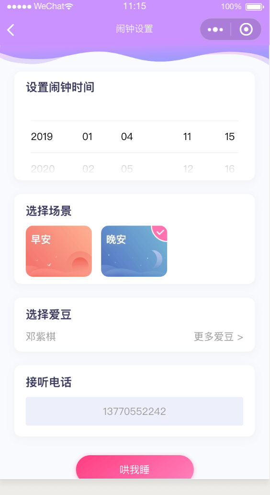

## 做一个时间选择器
最近需要做一个小程序项目的时候，遇到一个需要将时间选择器暴露在页面的需求。
如图：

<!-- more -->

## pick view
微信小程序提供了一些非常常见的pick组件，但是直接暴露在页面上的，只有`pick view`组件。因此这边只能使用这个了。😂

## 不上台面的代码片段
由于项目比较急，没有时间做优化，因此直接开搞。这边贴上代码。🤒
😈😈⚠️警告： 目前`picker-view`不支持给选中的column改变字体颜色，因此无法高亮选中的`picker-view-column`哪怕设置`indicator-style`或者给加上`indicator-class`都不好用！
但是可以给`indicator-style`添加背景色，就像这样 `indicator-style="background:#ff4400;"`。😂😂但是。。真的很丑😫😫😫😫

##  view 代码

```
   <picker-view indicator-style="height: 45px;"  indicator-class="indicator" bindchange="bindChange" value='{{defaultDate}}'>
      <picker-view-column>
        <view class='year' wx:for="{{years}}" wx:key="{{index}}">{{item}}</view>
      </picker-view-column>
      <picker-view-column>
        <view class='month' wx:for="{{months}}" wx:key="{{index}}">{{item}}</view>
      </picker-view-column>
      <picker-view-column>
        <view class='day' wx:for="{{days}}" wx:key="{{index}}">{{item}}</view>
      </picker-view-column>
      <picker-view-column>
        <view class='hour' wx:for="{{hours}}" wx:key="{{index}}">{{item}}</view>
      </picker-view-column>
      <picker-view-column>
        <view class='min' wx:for="{{mins}}" wx:key="{{index}}">{{item}}</view>
      </picker-view-column>
    </picker-view>

```
## 公共js代码

```
Array.prototype.indexVf = function(arr) {            
  for (var i = 0; i < this.length; i++) {                
    if (this[i] == arr) {                    
      return i;                
    }            
  }        
}


let years = []
let months = []
let days = []
let hours = []
let mins = []

let date = new Date();

// 格式化数字
function formatNum(val) {
  let formatVal;
  if (val < 10) {
    formatVal = `0${val}`
  } else {
    formatVal = val;
  }
  return formatVal;
}

// 初始化当前时间
function initYear() {
  let date = new Date();
  // 此处清空数组，防止数据污染
  years = [];
  months = [];
  days = [];
  hours = [];
  mins = [];
  for (let i = date.getFullYear(); i <= date.getFullYear() + 5; i++) {
    years.push(i)
  }

  for (let i = date.getMonth() + 1; i <= 12; i++) {
    months.push(formatNum(i));
  }
  // 根据月份 获取当前月的天数
  let countDays = new Date(date.getFullYear(), date.getMonth() + 1, 0).getDate();

  for (let i = date.getDate(); i <= countDays; i++) {
    days.push(formatNum(i));
  }

  for (let i = date.getHours(); i <= 23; i++) {
    hours.push(formatNum(i));
  }

  for (let i = date.getMinutes(); i <= 59; i++) {
    mins.push(formatNum(i))
  }

}
// 初始化 所有时间
function initAllYear(yy, mm) {
  // 此处清空数组，防止数据污染
   years = [];
   months = [];
   days = [];
   hours = [];
   mins = [];

  for (let i = date.getFullYear(); i <= date.getFullYear() + 5; i++) {
    years.push(i)
  }

  for (let i = 1; i <= 12; i++) {
    months.push(formatNum(i));
  }
  // 根据月份 获取当前月的天数
  let countDays = new Date(yy, mm, 0).getDate();

  for (let i = 1; i <= countDays; i++) {
    days.push(formatNum(i));
  }


  for (let i = 0; i <= 23; i++) {
    hours.push(formatNum(i));
  }

  for (let i = 0; i <= 59; i++) {
    mins.push(formatNum(i))
  }
}


```

## 页面js

```
page({
    data: {
    years,
    year: "",
    months,
    month: "",
    days,
    day: "",
    hours,
    hour: "",
    mins,
    min: "",
    defaultDate: []
  },
   // 选择大于当前年份的时候 需要重置 月日时分
  reMonDayHourMin(val) {
    // 获取最新日期，防止出现页面长时间停留，造成时间不准
    const date = new Date();
    // 选择了明年以后
    if (this.data.years[val[0]] > date.getFullYear()) {
      let months = [];
      for (let i = 1; i <= 12; i++) {
        months.push(formatNum(i))
      }
      this.setData({
        months
      })
    } else {
      let months = [];
      for (let i = date.getMonth() + 1; i <= 12; i++) {
        months.push(formatNum(i))
      }
      this.setData({
        months
      })
    }
  },
  // 选择本年度 不同月份后  需要重置 日时分
  reDayHourMin(val) {
    // 获取最新日期，防止出现页面长时间停留，造成时间不准
    const date = new Date();
    // 这边选择的月份 可能是 01 02，所以需要将其转成 1 2
    let formatSelMonth = parseInt(this.data.months[val[1]]);
    let countDays = new Date(this.data.years[val[0]], formatSelMonth, 0).getDate();
    let days = [];
    // 当前日期
    let CURDATE = `${date.getFullYear()}${formatNum(date.getMonth() + 1)}`;
    // 选中的日期
    let SELDATE = `${this.data.years[val[0]]}${this.data.months[val[1]]}`;
    if (CURDATE == SELDATE) {
      for (let i = date.getDate(); i <= countDays; i++) {
        days.push(formatNum(i))
      }
      this.setData({
        days
      })
    } else {
      for (let i = 1; i <= countDays; i++) {
        days.push(formatNum(i))
      }
      this.setData({
        days
      })
    }
  },
  // 选择本年度 本月份 不同日期的时候 需要重置 时分
  reHourMin(val) {
    // 获取最新日期，防止出现页面长时间停留，造成时间不准
    const date = new Date();
    // 当前日期
    let CURDATE = `${date.getFullYear()}${formatNum(date.getMonth() + 1)}${formatNum(date.getDate())}`;
    // 选择日期
    let SELDATE = `${this.data.years[val[0]]}${this.data.months[val[1]]}${this.data.days[val[2]]}`;
    let hours = [];
    if (CURDATE == SELDATE) {
      // 重置小时
      for (let i = date.getHours(); i <= 23; i++) {
        hours.push(formatNum(i))
      }
      this.setData({
        hours
      })
    } else {
      for (let i = 0; i <= 23; i++) {
        hours.push(formatNum(i))
      }
      this.setData({
        hours
      })
    }
  },
  // 选择本年度 本月份 同一日期的时候 需要重置 分钟
  reMin(val) {
    // 获取最新日期，防止出现页面长时间停留，造成时间不准
    const date = new Date();
    // 当前日期时间
    let CURDATETIME = `${date.getFullYear()}${formatNum(date.getMonth() + 1)}${formatNum(date.getDate())}${formatNum(date.getHours())}`;
    // 选择日期时间
    let SELDATETIME = `${this.data.years[val[0]]}${this.data.months[val[1]]}${this.data.days[val[2]]}${this.data.hours[val[3]]}`;
    let mins = [];
    if (CURDATETIME == SELDATETIME) {
      // 重置分钟
      for (let i = date.getMinutes(); i <= 59; i++) {
        mins.push(formatNum(i))
      }
      this.setData({
        mins
      })
    } else {
      for (let i = 0; i <= 59; i++) {
        mins.push(formatNum(i))
      }
      this.setData({
        mins
      })
    }
  },
   bindChange(e) {
    // pick view 改变值后的回调
    const val = e.detail.value;
    // 根据选择，重置对应的时间
    this.reMonDayHourMin(val);
    this.reDayHourMin(val);
    this.reHourMin(val);
    this.reMin(val);
    this.setData({
      year: this.data.years[val[0]],
      month: this.data.months[val[1]],
      day: this.data.days[val[2]],
      hour: this.data.hours[val[3]],
      min: this.data.mins[val[4]],
    })
  },
   onLoad: function(options) {
    console.log("options",options);
    let date = new Date();

    let {
        modalCardTime = "",
        modalCardDate = "",
        modalCardName = "",
        modalCardTel = "",
        modalCardAvatar = "",
        modalCardIdolid=""
    } = options;

    this.setData({
      modalCardTime,
      modalCardDate,
      modalCardName,
      modalCardTel,
      modalCardAvatar,
    })

  
    if (clockId > 0) {
      // 用户修改闹钟
      let resetYear;
      let resetMonth;
      let resetDate;
      let resetHour = modalCardTime.split(":")[0];
      let resetMin = modalCardTime.split(":")[1];

      if (modalCardDate == "今天") {
        resetYear = date.getFullYear();
        resetMonth = date.getMonth() + 1;
        resetDate = date.getDate();
      } else if (modalCardDate == "明天") {
        resetYear = date.getFullYear();
        resetMonth = date.getMonth() + 1;
        resetDate = date.getDate() + 1;
      } else {
        resetYear = parseInt(modalCardDate.split('-')[0]);
        resetMonth = parseInt(modalCardDate.split('-')[1]);
        resetDate = parseInt(modalCardDate.split('-')[2]);
      }

      initAllYear(resetYear, resetMonth);
      this.setData({
        years,
        months,
        days,
        hours,
        mins
      })

      let yearIndex = this.data.years.indexVf(resetYear);
      let monthIndex = this.data.months.indexVf(resetMonth);
      let dayIndex = this.data.days.indexVf(resetDate);
      let hourIndex = this.data.hours.indexVf(resetHour);
      let minIndex = this.data.mins.indexVf(resetMin);

      this.setData({
        defaultDate: [yearIndex, monthIndex, dayIndex, hourIndex, minIndex],
      })

    } else {
      initYear();
      this.setData({
        years,
        months,
        days,
        hours,
        mins
      })
    }
  }
})
```

## 关于pick-view组件
⚠️⚠️ 这些代码片段是我直接在项目中复制过来的，因此无法直接在小程序跑。这边只是提供了一个简单的思路，给有需要的人或者未来的自己（记忆不好）😂😂😂。

>> value	
>> NumberArray	
>> 数组中的数字依次表示 picker-view 内的 picker-view-column 选择的第几项（下标从 0 开始），数字大于 picker-view-column 可选项长度时，选择最后一项。


1. `pick-view`提供了`NumberArray`类型的`value`属性，所以他只能是数字组成的数组，`[1,2,3,4,5]`而不能是`["1","2","3","4","5"]`。 因此需要做`Number`化。 通过`value`属性，我们可以设置默认展示的`picker-view-column`值。
2. 因为需求中需要做不足10补零的操作，因此需要转换一下。比如`3`需要转化成`03`。但是在通过`bindChange`后选择出来的就是`03`了，因此⚠️需要做`parseInt`操作。可以直接将`03`转成`3`;
3. 需求需要不能选择小于当前时间，即不能出现小于当前时间的选项，因此需要通过几个方法`reMonDayHourMin`,`reDayHourMin`,`reHourMin`,`reMin`来比对选择的时间和当前的时间，防止出现选择其他时间后，选项不出来的bug。
4. 最后，在进入页面的时候需要重新获取最新的时间，`let date = new date()`;防止用户长时间停留页面，造成时间不准的情况

Thanks,新的一年。加油！❤️